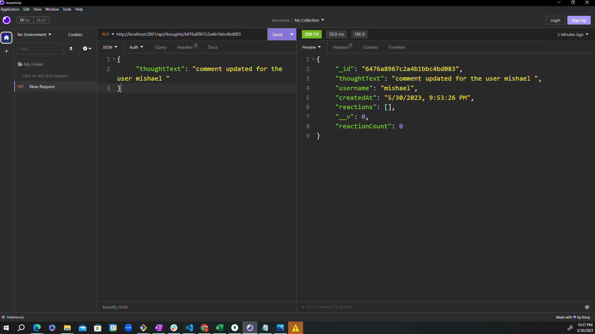

# 18 NoSQL: Social Network API
## Table of contents
- Overview
    - The Challenge
    - Screenshot
    - Links
- My Approach
    - Code construction
    - Learnings
- Author
## Overview

## The Challenge
GIVEN a social network API
WHEN I enter the command to invoke the application
THEN my server is started and the Mongoose models are synced to the MongoDB database
WHEN I open API GET routes in Insomnia for users and thoughts
THEN the data for each of these routes is displayed in a formatted JSON
WHEN I test API POST, PUT, and DELETE routes in Insomnia
THEN I am able to successfully create, update, and delete users and thoughts in my database
WHEN I test API POST and DELETE routes in Insomnia
THEN I am able to successfully create and delete reactions to thoughts and add and remove friends to a user’s friend list

## Screenshot

### Links
Github URL:  https://github.com/amalahema/social_network_API

### Code Construction
- mongoose, Schema and model
- express & node.js
- Router & controller

### Learnings
- How do connect the server with mongodb
- How to create a database in the schema  and  design the table 
- How to add a reference to the table and join the data of the multiple tables
- How to display data for the particular URL
- How to get, post, and delete the data in the table
- How to import the router to index.js
- How to use async and await
- How to use try and catch method

Walkthrough Video:

https://app.screencastify.com/manage/videos/LEE9HP7VCqa9kQDLo0sY

